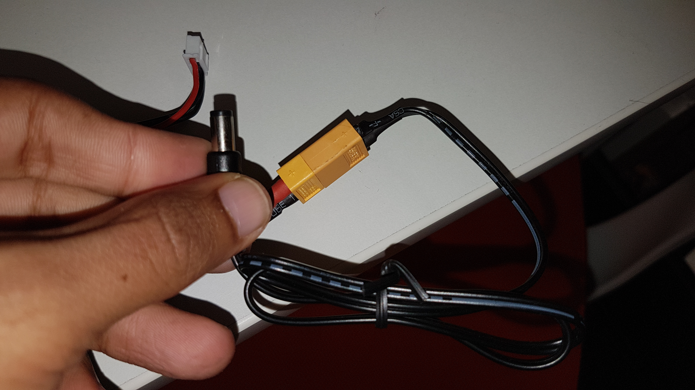
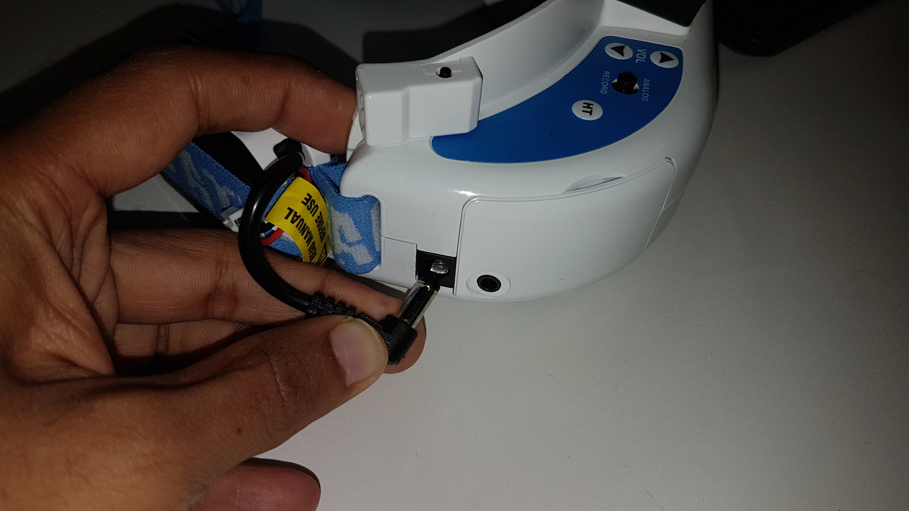
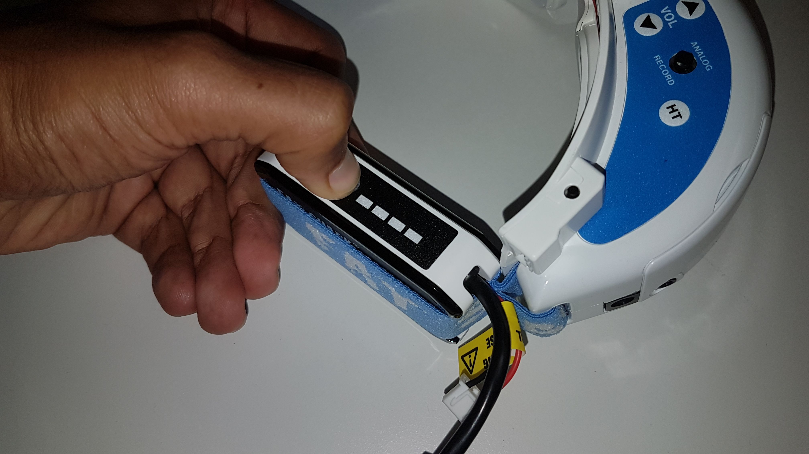
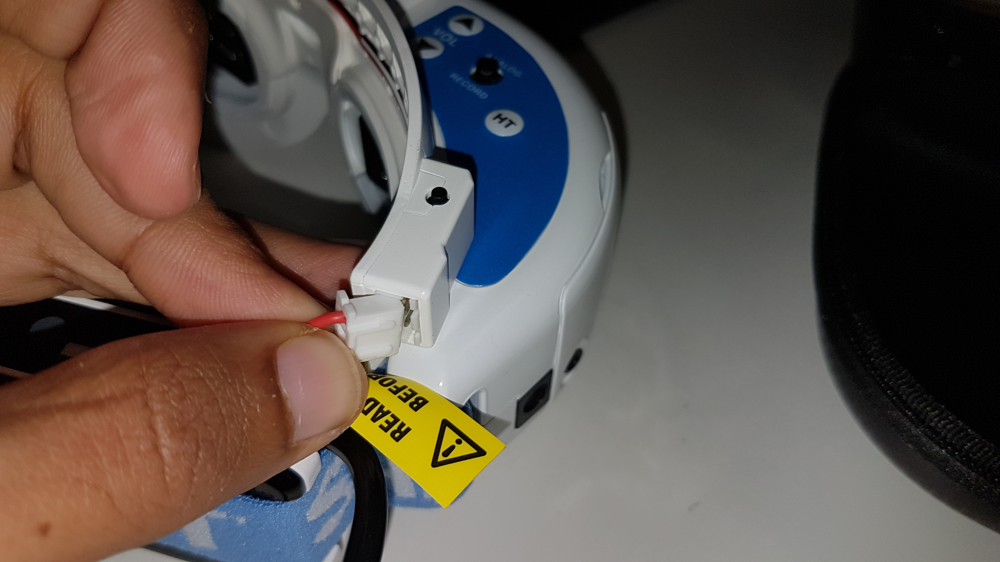

# FPV-Goggles-and-ProSight-Transmitter-Receiver-Pair

## Hookup Guide and Documentation
----------------------
This project deals with setting up and testing the different uses of Fat Shark FPV Goggles and Connex ProSight Camera Tx and Rx.
# How to Power up the FPV Goggles
* It is powered through the barrel jack connector on the included USB Rechargeable Battery.

  

  

* The Battery has a four block Power Indicator.

  

* The Goggles has an in-built cooling fan which is powered through the 3 Pin RMC connector on the device.

  

* The Fan can be switched on by pressing the tactile switch on the top of the goggles.
# How to Connect the goggles as an FPV
* The goggles has 2 input modes and 4 output modes.

    I/P
    **HDMI
    **AV
    O/P
    **HDMI 2D
    **HDMI 3D
    **AV 2D
    **AV 3D
* The HDMI connector on the FPV is a miniature version of the standard, hence requires a converter cable.

# How to Power up the Connex Camera module and Transmitter