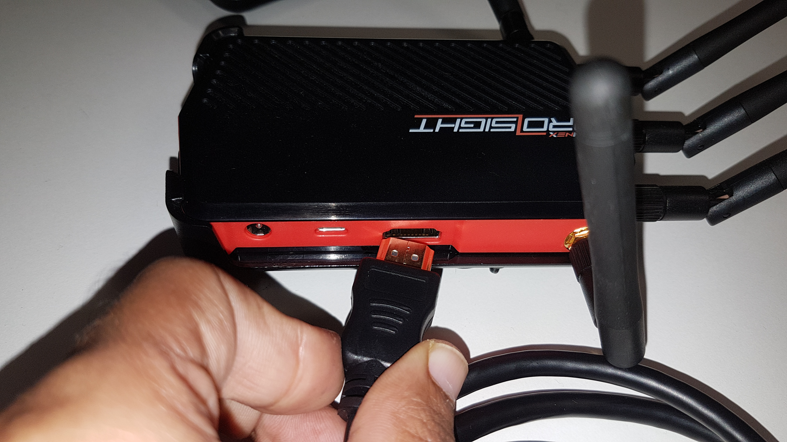
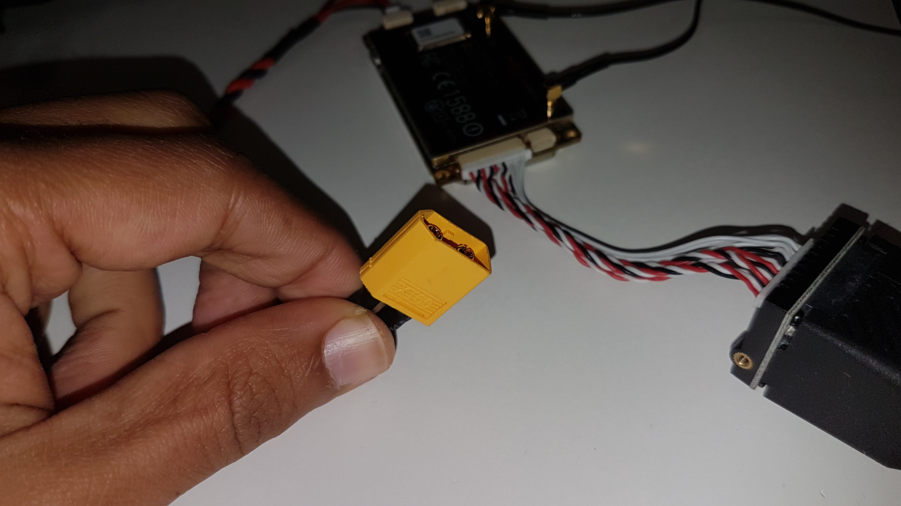
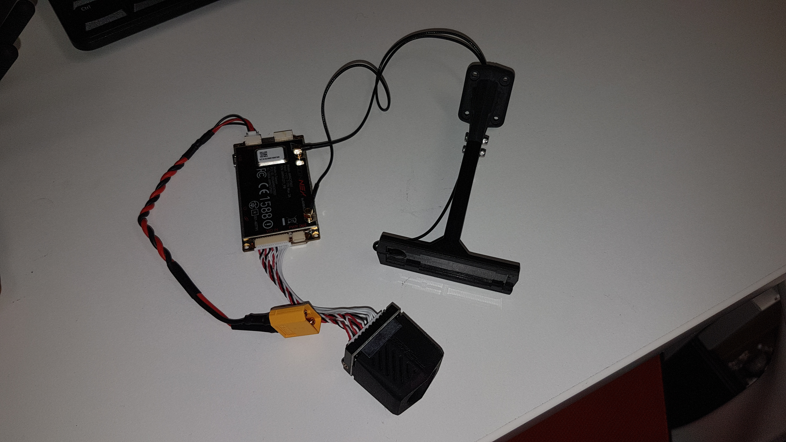
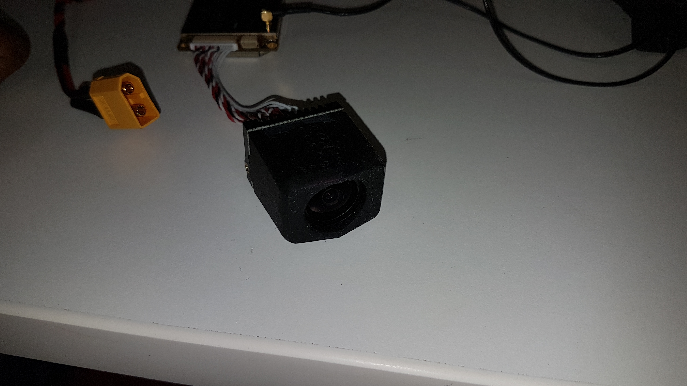
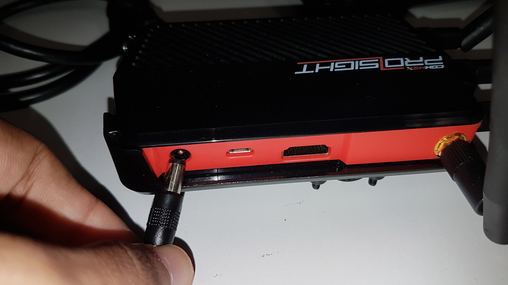
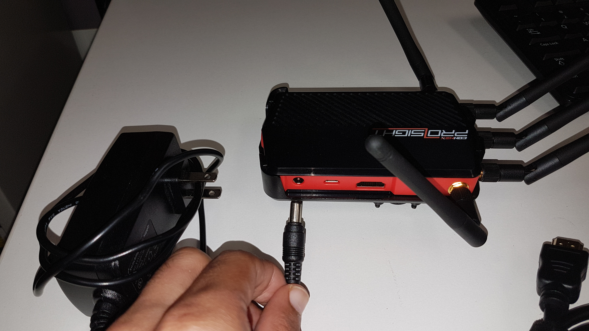
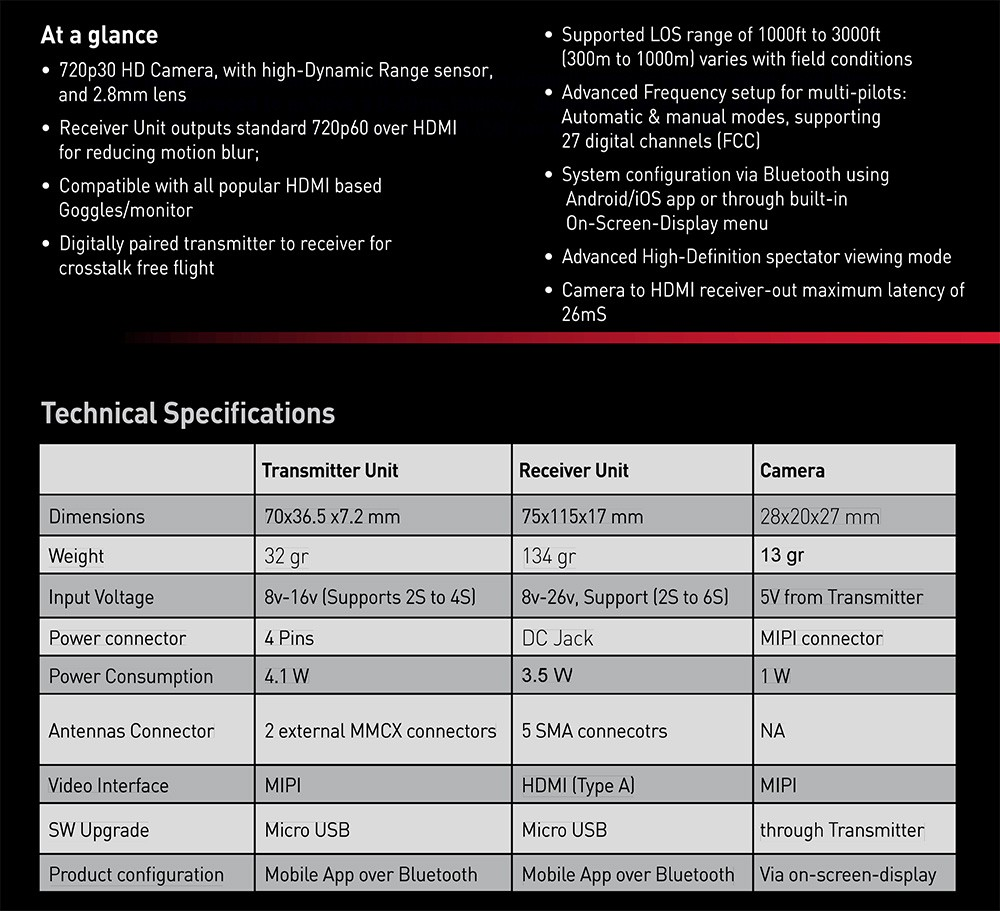
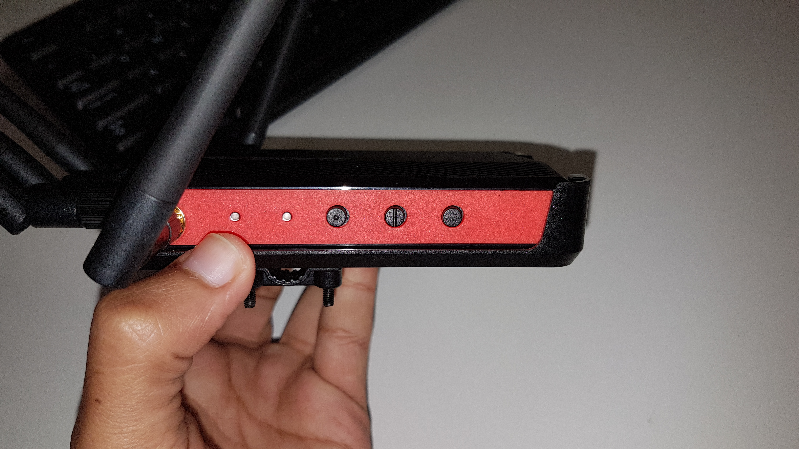
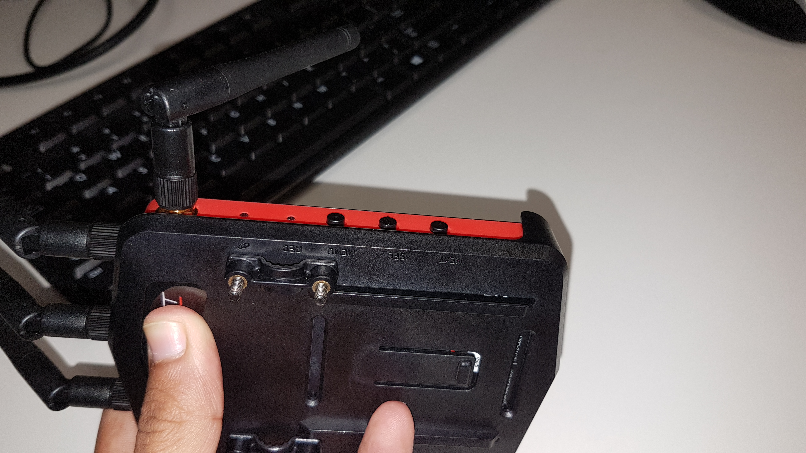

# FPV-Goggles-and-ProSight-Transmitter-Receiver-Pair

## Hookup Guide and Documentation
----------------------
###### This project deals with setting up and testing the different uses of Fat Shark FPV Goggles and Connex ProSight Camera Tx and Rx.

# How to Power up the FPV Goggles
* It is powered through the barrel jack connector on the included USB Rechargeable Battery.

  

  

* The Battery has a four block Power Indicator.

  

* The Goggles has an in-built cooling fan which is powered through the 3 Pin RMC connector on the device.

  

* The Fan can be switched on by pressing the tactile switch on the top of the goggles.

  
# How to Connect the goggles as an FPV
* The goggles has 2 input modes and 4 output modes.

### I/P

1. HDMI
2. AV

### O/P

1. HDMI 2D
2. HDMI 3D
3. AV 2D
4. AV 3D

- The HDMI connector on the FPV is a miniature version of the standard, hence requires a converter cable.

  

# How to Power up the Connex Camera Module and Transmitter

- The Camera and Antenna are powered with a Lithium Polymer Battery through an XT60 Connector.

  

  

- It requires no Pre / Post power on configuration.

- The Camera has a rubberized sleeve for resisting shocks and scratches.

  

- The module needs to be oriented in the right way, i.e. The notch or marking facing the top.

  # How to Power up the Connex ProSight Receiver

- The Receiver can either be powered through a Lithium Polymer Battery (with Barrel jack breakout or a Wall Adapter)

  

  

  

- The Safe input voltage range is from **8 Volts to 26 Volts

  

- The Receiver can be hacked to run at 5 volts from a USB Port.

- The Receiver has a operating range from 1000 ft to 3000 ft LOS.

- The module has an OSD User Interface and can be navigated by the hardware buttons.

  

  

# How to Connect Multiple Displays to Connex Receiver (Ground Station Cloning)

- The Video can be streamed onto different displays through an HDMI Splitter  box (8 displays) or an HDMI Splitter cable (2 displays).

  ###### Links / URL

  ###### 1. SPLITTER BOX (1 input - 8 outputs)
<https://www.monoprice.com/product?p_id=14526&gclid=EAIaIQobChMI1vPp1d_v3AIVkJ-fCh2YUQRnEAQYBCABEgKgDfD_BwE>

  ###### 2. SPLITTER CABLE (1 input - 2 outputs)

  ##### https://www.walmart.com/ip/AMZER-30cm-HDMI-Male-to-Dual-HDMI-Female-1-4-Version-Cable-Connector-Adapter/789596176?wmlspartner=wlpa&selectedSellerId=0&adid=22222222227162515730&wl0=&wl1=g&wl2=c&wl3=274805517825&wl4=pla-456922318243&wl5=9005557&wl6=&wl7=&wl8=&wl9=pla&wl10=8175035&wl11=online&wl12=789596176&wl13=&veh=sem

###### NOTE - All slave displays will be receiving the cloned data from the master.

# Miscellaneous Notes

- The Receiver can be paired with CONNEX ProSight App for Mobile Streaming. (Yet to be Tested)

- The HDMI data cannot be streamed to laptops  as they don't have HDMI inputs. But we can use some HDMI capturing devices to  get the footage from the camera on to the Laptop (Really Expensive  Starting at $300)

  ###### Links / URL

  ###### https://www.amazon.com/Magewell-HDMI-Video-Capture-Dongle/dp/B00I16VQOY/ref=pd_lpo_vtph_147_tr_t_2?_encoding=UTF8&psc=1&refRID=H66P7BG0P5GJ95F247DE